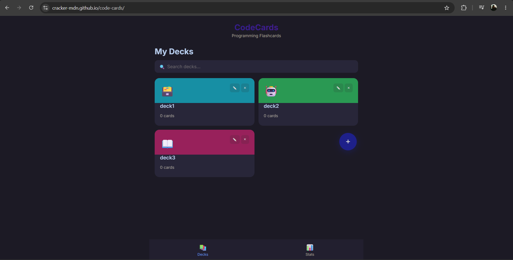
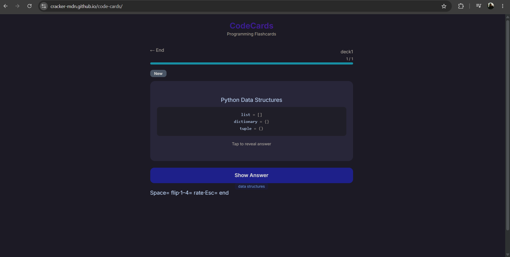
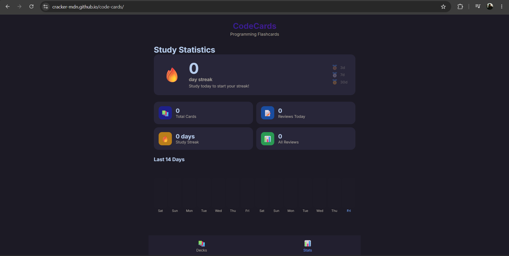

# CodeCards — Programming Flashcards

An interactive flashcard application designed for learning programming concepts, featuring **spaced repetition**, **code syntax highlighting**, and **progress tracking**. Built entirely in **F#** using [Fable](https://fable.io/) (F# → JavaScript compiler) and [Feliz](https://github.com/Zaid-Ajaj/Feliz) (React bindings).

## Try it Live

👉 **[https://cracker-mdn.github.io/code-cards/](https://cracker-mdn.github.io/code-cards/)**

## Screenshots





## Motivation

Learning to code requires memorizing syntax, patterns, and concepts across multiple languages. Generic flashcard apps lack code formatting, and existing programming quiz platforms don't use spaced repetition — the most scientifically effective memorization technique. CodeCards bridges this gap by combining **Anki-style spaced repetition** with **programming-focused features** like syntax highlighting and multi-language support.

## Features

- **Deck Management** — Create, edit, and organize flashcard decks with custom colors and icons.
- **Rich Card Editor** — Cards support front/back text, code snippets with syntax highlighting, and tags.
- **Syntax Highlighting** — Built-in tokenizer for F#, Python, JavaScript, C#, SQL, HTML, and CSS with color-coded keywords, strings, comments, and numbers.
- **Spaced Repetition (SM-2)** — Adaptive scheduling algorithm that optimizes review intervals based on your recall performance. Rate cards as Again/Hard/Good/Easy.
- **Review Sessions** — Clean, distraction-free study interface with card flip animation. Keyboard shortcuts (Space to flip, 1-4 to rate).
- **Progress Tracking** — Mastery levels (New → Learning → Reviewing → Mastered), study streaks, daily activity charts, and accuracy breakdown.
- **Import/Export** — Share decks as JSON. Copy to clipboard for easy sharing.
- **Persistent Storage** — All data saved in `localStorage`. No account needed.
- **Responsive Design** — Mobile-first dark theme with purple/indigo palette.

## Tech Stack

| Layer | Technology |
|-------|------------|
| Language | F# 8.0 |
| Compiler | Fable 4.x (F# → JavaScript) |
| UI Library | Feliz 2.x (React bindings) |
| Serialization | Thoth.Json |
| Bundler | Vite |
| Hosting | GitHub Pages |

## Architecture

The app follows the **Elm Architecture** (Model-View-Update) with 10 modules:

- **`Types.fs`** — Domain types (Card, Deck, SRData, MasteryLevel, Difficulty) and helpers
- **`Storage.fs`** — localStorage persistence with Thoth.Json encoders/decoders, import/export
- **`SpacedRepetition.fs`** — SM-2 algorithm implementation: interval calculation, ease factor adjustment, due card selection
- **`CodeHighlight.fs`** — Regex-based tokenizer for 7 programming languages with Feliz rendering
- **`DeckManager.fs`** — Deck list grid, creation/edit modal, mastery progress bars
- **`CardEditor.fs`** — Card form with language selector, code editor, live preview
- **`ReviewSession.fs`** — Flip-card study UI, difficulty rating, session summary
- **`Stats.fs`** — Activity charts, mastery distribution, accuracy breakdown
- **`App.fs`** — Root init/update/view, deck detail view, navigation
- **`Main.fs`** — React entry point with keyboard shortcuts

## Prerequisites

- [.NET 8 SDK](https://dotnet.microsoft.com/download/dotnet/8.0)
- [Node.js 18+](https://nodejs.org/)

## Build & Run

```bash
git clone https://github.com/cracker-MDN/code-cards.git
cd code-cards
dotnet tool restore
dotnet restore src
npm install
npm start
```

The app opens at `http://localhost:5173`.

## Production Build

```bash
npm run build
```

Output in `dist/`.

## License

MIT
